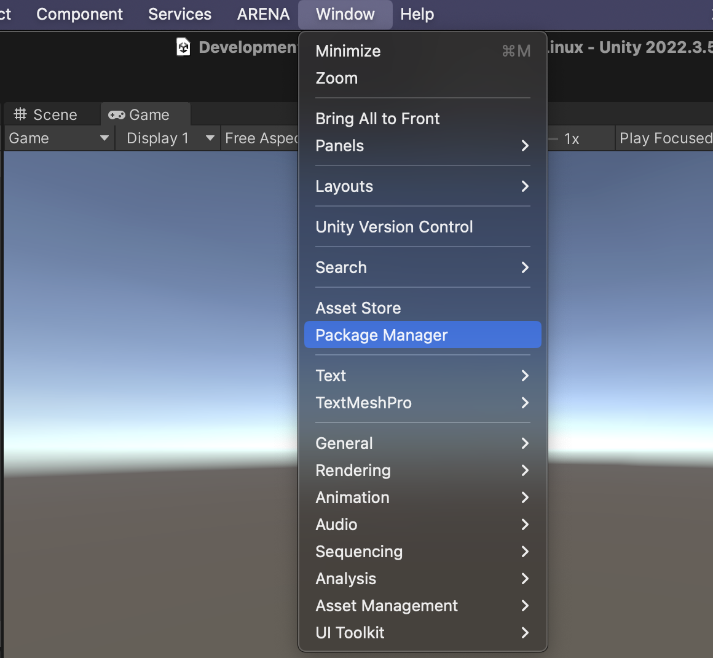
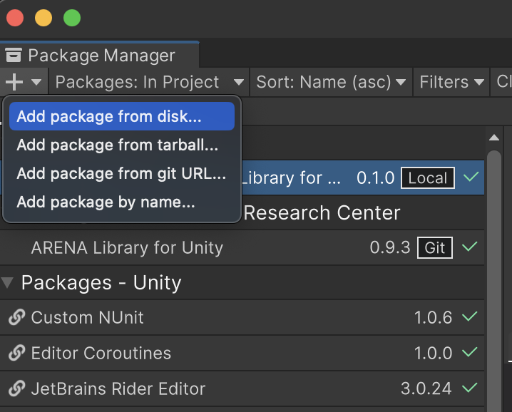
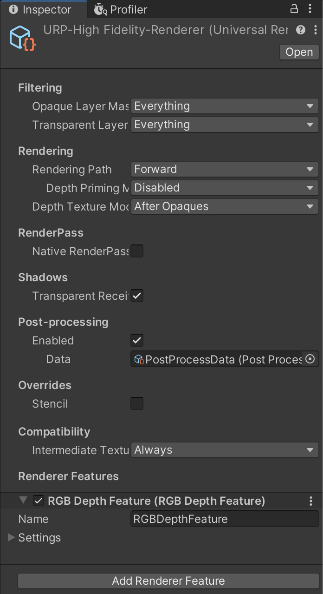
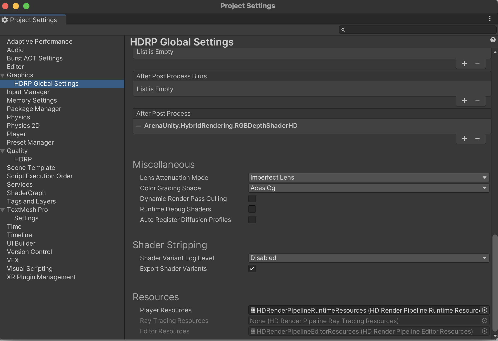

# Installation

*For AR/VR clients, it is reccomeneded you use this package in __URP__ or __HDRP__ for the best performance.*

First, install the [ARENA-unity](https://github.com/arenaxr/arena-unity) package, following the instructions [here](https://docs.arenaxr.org/content/unity/).

To install the RenderFusion Unity package, select `Window/Package Manager` from the menu bar.



Then, select `+` and `Add package from git URL...`.



Input the string below to the input field.
```
https://github.com/arenaxr/arena-renderfusion.git
```

## Prefabs

You should include the Prefab from `ARENA RenderFusion for Unity/Runtime/Prefabs` in your scene.

## URP

If you are working in URP, __also__ install
```
https://github.com/arenaxr/arena-renderfusion.git?path=/Addons~/io.conix.arena.renderfusion-urp
```
IMPORTANT: Your URP Settings should include the `RGB Depth Feature` post processing effect that comes with this library.



## HDRP

If you are working in HDRP, __also__ install
```
https://github.com/arenaxr/arena-renderfusion.git?path=/Addons~/io.conix.arena.renderfusion-hdrp
```
IMPORTANT: Your HDRP Global Settings should include the `ArenaUnity.RenderFusion.RGBDepthShaderHD` in the `After Post Process` item under the `Custom Post Process Order` list.


